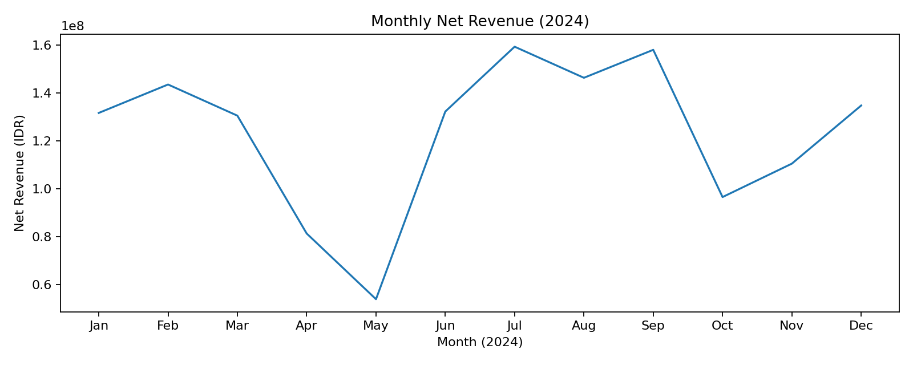
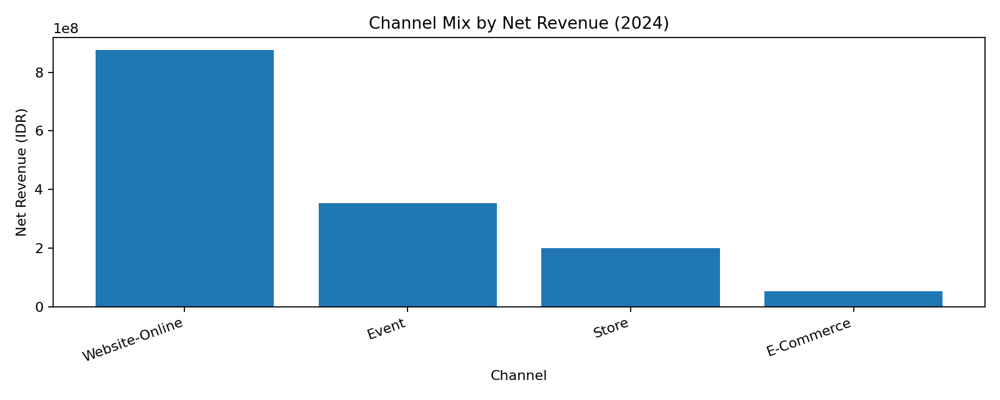
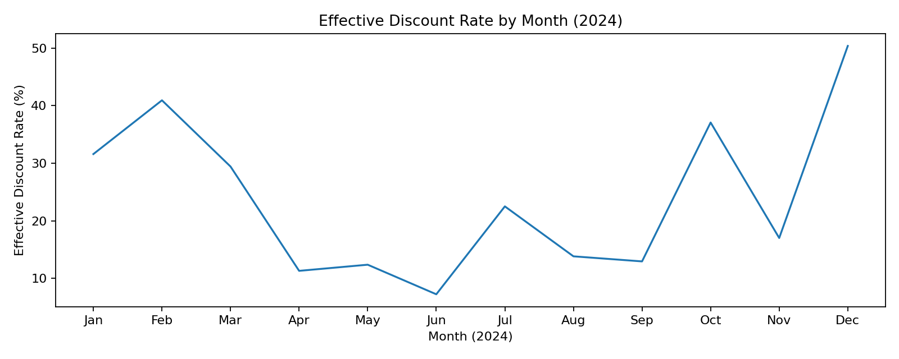
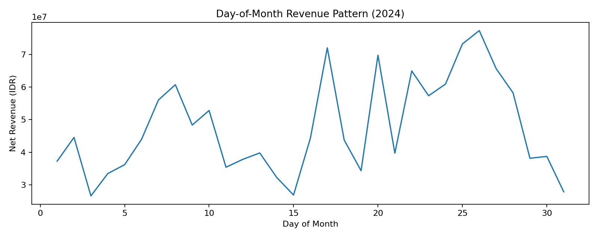
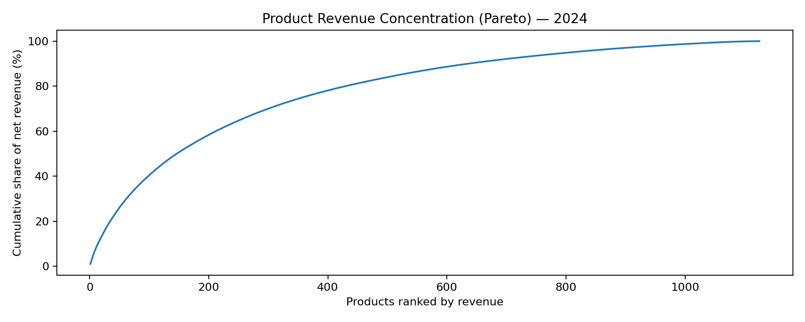

# Sales Reporting 2024 — KPI Pack & Trend Analysis

A portfolio-ready case study built from a Dummy Data for 2024.  
Focus: **KPI reporting, MoM/YoY trends, channel mix, discount intensity, and payday patterns**.

## Snapshot (2024)
- **Net revenue:** Rp 1.478.243.443
- **Orders:** 4,097
- **Units (qty):** 6,272
- **AOV:** Rp 360.811
- **Unique products:** 1,125 (top 10 contribute only **7.8%** of revenue)

### Peaks & patterns
- **Highest monthly revenue:** **July** (Rp 159.312.100)
- **Highest orders:** **February** (510 orders)
- **Highest AOV:** **October** (Rp 536.028)
- **Highest effective discount rate:** **December** (~50.4%)
- **Top day-of-month revenue:** **26** (Rp 77.339.300)

## Key visuals






## Repository structure
- `data_sample/` sample anonymized data (safe to share)
- `src/` reusable Python code (metrics + charts)
- `notebooks/` optional notebook demos
- `reports/` generated summaries and charts

## How to run (local)
1) Install deps:
```bash
pip install -r requirements.txt
```

2) Run analysis using the sample data:
```bash
python src/run_analysis.py --input data_sample/sample_sales_reporting_2024_anonymized.csv --out reports
```

## Confidentiality
This repo only contains **anonymized / sample** data. No raw company identifiers are included.
